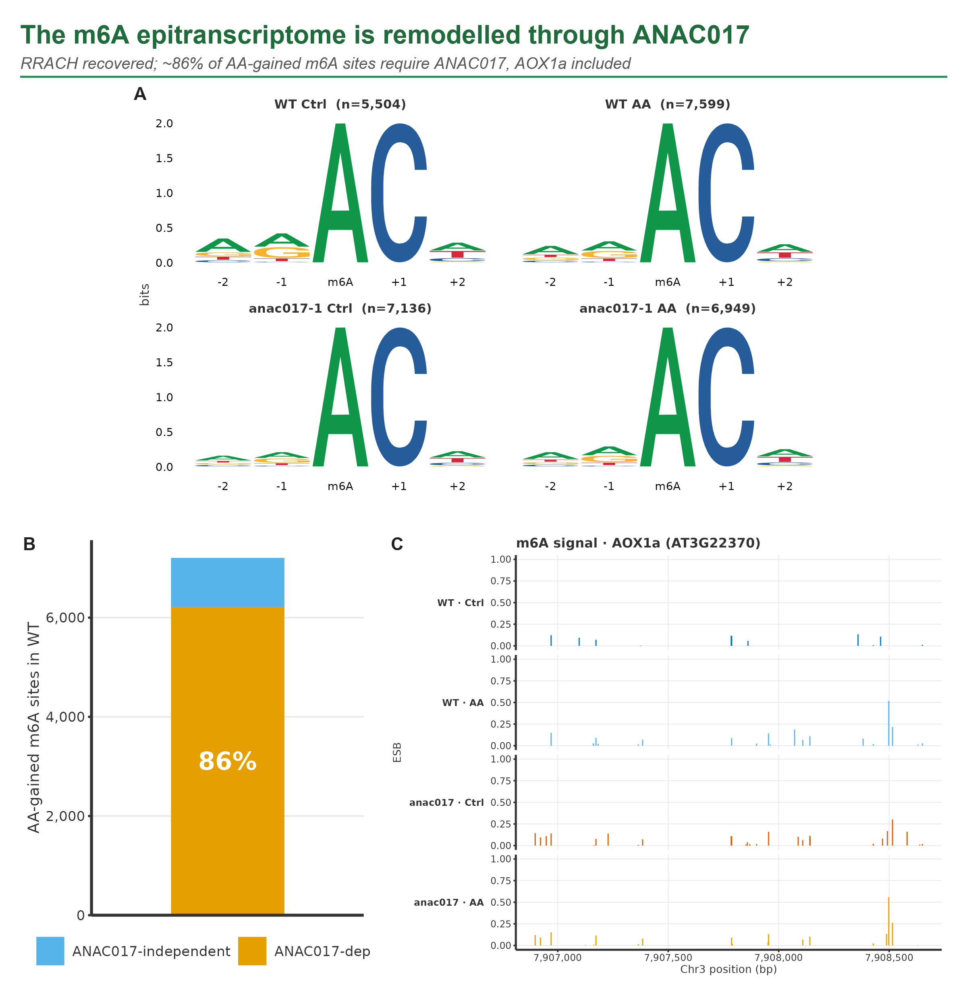

# K-CHOPORE · ANAC017-dependent m6A in the *Arabidopsis* retrograde response

A reproducible, containerised Snakemake pipeline that reads the plant **m6A epitranscriptome** from raw Oxford Nanopore Direct RNA-seq signal, applied to the **ANAC017-controlled mitochondrial retrograde response** in *Arabidopsis thaliana*.

[](LICENSE)
[](https://snakemake.github.io)
[](Dockerfile)
[](CITATION.cff)

This is a follow-up study. The contribution is the reproducible route and a reusable resource, not a first description of m6A or of retrograde signalling.

## The question

Antimycin A blocks complex III of the mitochondrial electron transport chain, which triggers a burst of ROS and a retrograde signal to the nucleus. **ANAC017** is the transcription factor that relays it. The question here: does mitochondrial stress remodel the m6A epitranscriptome, and does that remodelling depend on ANAC017? We answer it on a clean 2×2 design and, along the way, package the whole analysis so it runs again with one command.

## Headline results

Design: WT vs *anac017-1* × Control vs Antimycin A, three biological replicates, **12 Direct RNA-seq libraries**. Expression separates genotype on PC1 and treatment on PC2.

- **Differential expression** (DESeq2, transcript-level, `lfcShrink`): **151** transcripts respond to Antimycin A in WT, **93** carry a basal genotype effect, **19** sit in the interaction term, their AA response requires ANAC017 (AOX1a among them).
- **m6A motif**: the canonical **RRACH** is recovered in all four conditions, validated genetically against five writer mutants (*mta, mtb, fip37, vir, hakai*).
- **ANAC017 dependence**: of the m6A sites gained under Antimycin A in WT (7,202), **~86%** (6,225) are not gained in *anac017-1*.
- **Writer identity**: **~97%** of the gained sites are independently recovered by the *mta* (METTL3) knockout contrast, so they are genuine m6A, not error signal.
- **Coverage-normalised m6A density**: **93–120 sites per 1,000 A**, comparable across conditions. AOX1a (AT3G22370) gains 3′ m6A under stress.



## What you get

One Snakemake workflow, one `config`, one Docker image, from raw signal to function:

basecalling → read QC/filtering (NanoPlot, NanoComp, pycoQC) → mapping (minimap2) → isoforms (FLAIR, StringTie) → **m6A** (ELIGOS2, error-based; m6anet, signal-level where coverage allows) → differential expression (DESeq2) → functional enrichment (clusterProfiler / g:Profiler) → aggregate report (MultiQC).

Each rule writes both a QC artifact and a result. Precomputed steps are reused, so editing the config defines a new run and only what changed re-runs.

## Quickstart

```bash
docker build -t kchopore-anac017-drs:latest .

docker run --rm -v "$PWD":/workspace -v /path/to/data:/data -w /workspace \
  kchopore-anac017-drs:latest \
  snakemake --configfile config/config_transcriptome.yml --cores 12 \
  --rerun-triggers mtime --keep-going
```

`config/config_transcriptome.yml` is the canonical config for this study (mapping and m6A on the FLAIR transcriptome). Edit only the config (samples, paths, `run_*` module flags) to analyse a new dataset. A dry run shows the full plan without executing it:

```bash
snakemake -n --configfile config/config_transcriptome.yml
```

See [`MANUAL.md`](MANUAL.md) for the step-by-step runbook and per-tool settings.

## Repository map

```
Snakefile                 the workflow (≈25 rules)
config/                   config_transcriptome.yml (canonical) + variants
scripts/                  analysis and figure scripts (DESeq2, ELIGOS2/m6A, GO)
envs/                     environment.yml + frozen/ (exact versions per conda env)
Dockerfile                full software stack, pinned
docs/
  report_kchopore.qmd     short reproducible results report (Quarto)
  figures/                final figures (PNG + PDF)
  tables/                 result tables (DE, m6A, GO/KEGG)
presentations/            2-minute flash talk (Quarto revealjs)
MANUAL.md                 consolidated runbook + provenance
METHODS_TOOLS.md          per-tool settings, filters and outputs
CITATION.cff · LICENSE    citation metadata + MIT
```

## Figures and tables

Every panel is reproducible from a tracked tidy table and a script. Final figures live in [`docs/figures/`](docs/figures/), result tables in [`docs/tables/`](docs/tables/).

| Figure | Shows | Source table |
|---|---|---|
| [`fig1-qc-design.png`](docs/figures/fig1-qc-design.png) | Library QC + PCA + dispersion | — |
| [`fig2-differential-expression.png`](docs/figures/fig2-differential-expression.png) | Volcanoes + MA + heatmap (151/93/19) | `tidy_de_*.csv` |
| [`fig3-m6a-anac017.png`](docs/figures/fig3-m6a-anac017.png) | RRACH + 86% ANAC017-dependent + AOX1a | `m6a_summary.csv` |
| [`fig4-m6a-identity-metagene.png`](docs/figures/fig4-m6a-identity-metagene.png) | 97% MTA identity + 3′ metagene | `taskA_mta_identity.csv` |
| [`fig5-function-go.png`](docs/figures/fig5-function-go.png) | GO:BP of the AA-responsive set | `ora_GO_BP_simplified_AA_in_WT.csv` |
| [`aox1a-track.png`](docs/figures/aox1a-track.png) | m6A along AOX1a (AT3G22370) | — |

## Reproducibility

The full software stack is pinned in the `Dockerfile`; exact versions from the working analysis environments are frozen in [`envs/frozen/`](envs/frozen/) (one file per conda env: `kchopore`, `m6anet`, `xpore`, `viz`, `pycoqc_env`). Runs are config-driven and reuse precomputed steps. Open items are tracked honestly: RNG seeds are not yet fixed, and the raw-data accession and release DOI are pending.

m6A is called by error-based ELIGOS2 against the writer mutants; m6anet (signal-level) is a partial orthogonal check where coverage allows, not a complete second validation. "ANAC017-dependent" means a genetic dependence in the mutant, a description rather than a demonstrated mechanism.

## Data availability

Raw Direct RNA-seq signal is large and is not stored here. Accession: ENA `PRJEBXXXXXX` / GEO `GSEXXXXXX` (to be assigned). See `MANUAL.md` for mounting the data.

## Citation, license, authors

If you use K-CHOPORE, cite it via [`CITATION.cff`](CITATION.cff). Released under the [MIT license](LICENSE).

Pelayo G. de Lena · Jesús Pascual · Mario F. Fraga · Luis Valledor — Universidad de Oviedo · CINN-CSIC · ISPA/FINBA · IUOPA · CIBERER.
