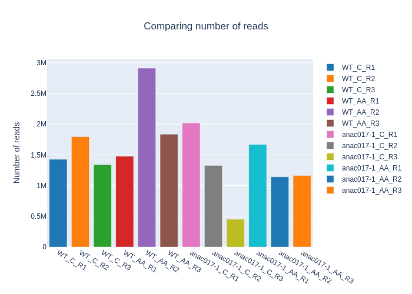
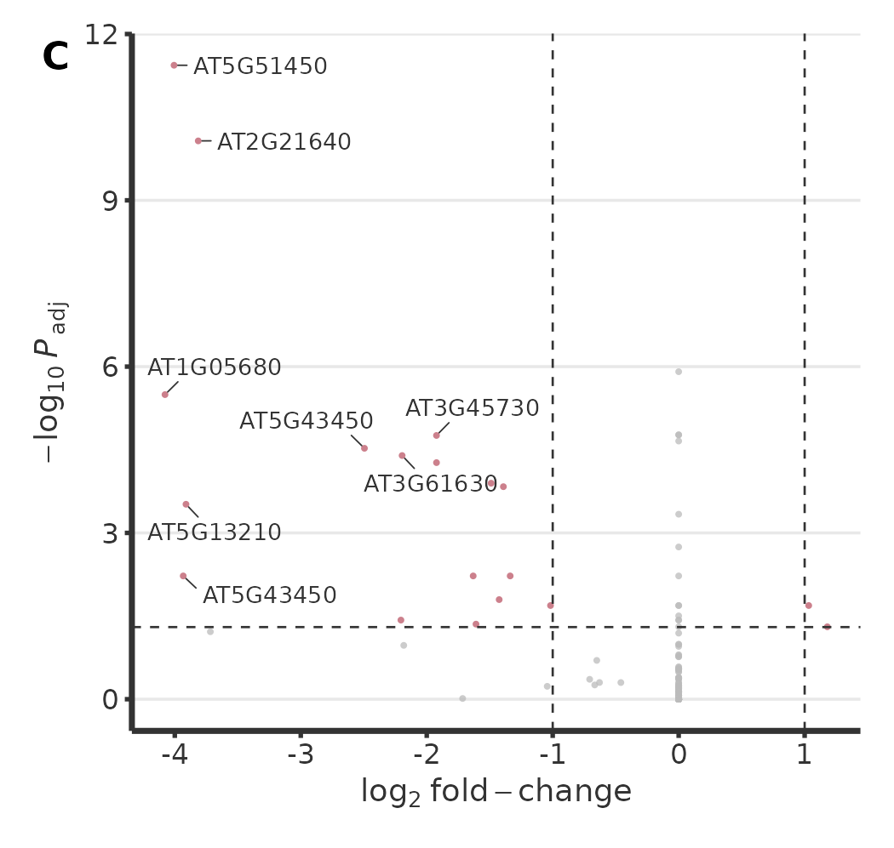
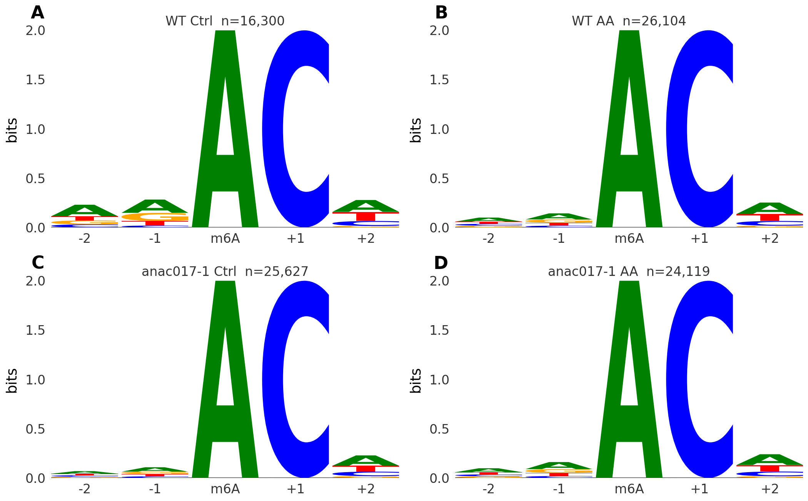
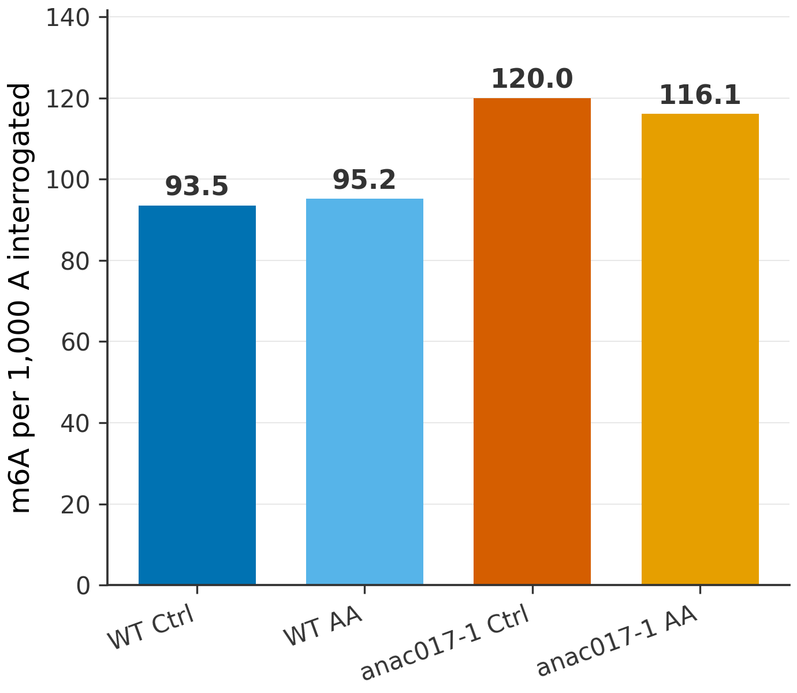
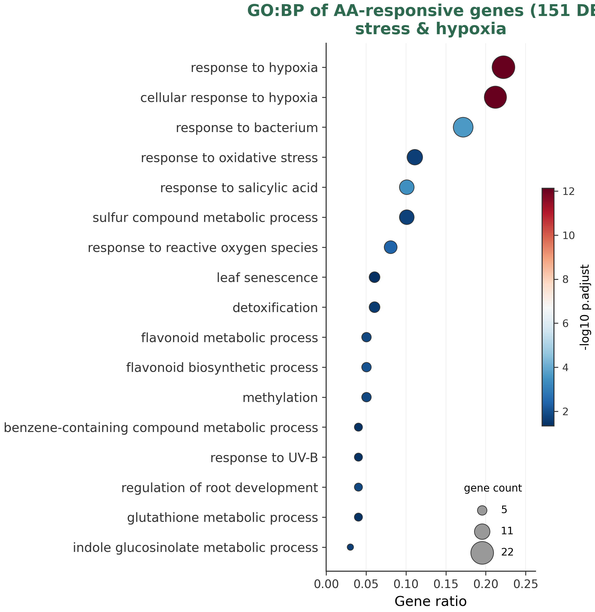

# Introduction

m6A shapes transcript stability, splicing and translation. Direct RNA-seq reads modifications on native RNA without amplification, preserving the signal that error-based and signal-based callers exploit. Plant epitranscriptomics, however, lacks reproducible, containerised pipelines.

**K-CHOPORE** addresses this: one Snakemake workflow, one config, a Docker image with the full stack, and reuse of precomputed steps so only what changed re-runs. We demonstrate it on **mitochondrial retrograde signalling**: Antimycin A inhibits complex III, triggering a retrograde response whose master regulator is the transcription factor **ANAC017**.

# Methods

**Design (2×2).** Genotype (WT vs *anac017-1*) × treatment (Control vs Antimycin A), three biological replicates — 12 DRS libraries.

**Pipeline.** Basecalling (Guppy) → mapping to a FLAIR transcriptome (minimap2, `-ax map-ont`) → QC (NanoPlot, NanoComp, pycoQC, MultiQC) → isoforms (FLAIR, StringTie) → m6A by two orthogonal methods (ELIGOS2, error-based and genetically validated against m6A-writer mutants *mta/mtb/fip37/vir/hakai*; m6anet, signal-level) → differential expression (DESeq2, transcript-level, `~genotype+treatment+genotype:treatment`) → functional enrichment (g:Profiler). Cross-condition comparisons use coverage-normalised rates. Per-tool settings and filters are listed in `METHODS_TOOLS.md`.

# Results

## Quality control

Read quality and yield are consistent across the 12 libraries (NanoComp, Fig. 1).

{#fig-qc width="85%"}

## Expression captures the design

PCA on variance-stabilised counts separates genotype (PC1) and treatment (PC2), with replicates clustering tightly (@fig-pca). Differential expression yields 151 transcripts responding to Antimycin A, 93 with a basal genotype effect, and **19 transcripts with an ANAC017-dependent response** (genotype×treatment interaction; @fig-volcano).

::: {layout-ncol=2}
{#fig-pca}

{#fig-volcano}
:::

## The m6A epitranscriptome

ELIGOS2 recovers the canonical **RRACH** motif in all conditions, re-centred on the modified adenosine (@fig-motif). After coverage normalisation, m6A density is comparable across conditions (93–120 sites per 1,000 tested adenosines), with *anac017-1* showing the highest basal rate (@fig-rate) — the raw counts alone would have been misleading due to depth differences.

::: {layout-ncol=2}
{#fig-motif}

{#fig-rate}
:::

At the retrograde marker **AOX1a** (AT3G22370), m6A signal increases at the 3′ end under Antimycin A (@fig-aox1a). Across the genome, ~86% of AA-gained m6A sites in WT are not gained in *anac017-1*, i.e. **ANAC017-dependent**.

{#fig-aox1a width="80%"}

## Function

The Antimycin-A-responsive genes (151 DE in WT) are enriched in response to hypoxia, oxidative stress and reactive oxygen species (clusterProfiler GO:BP; e.g. *CYP81D8*), consistent with complex-III inhibition mimicking an energy/oxygen stress (@fig-go). The 19 ANAC017-dependent interaction genes alone are too few for significant enrichment.

{#fig-go width="80%"}

# Discussion

The results sketch a model in which **mitochondrial stress reshapes the plant m6A epitranscriptome through ANAC017-dependent retrograde signalling**. The interaction term isolates the transcripts whose AA response requires ANAC017, and AOX1a — the canonical retrograde target — gains m6A under stress. Coverage normalisation was essential: comparing raw site counts would have confounded biology with sequencing depth. This is a follow-up study; the value here is the reproducible route from signal to a coverage-controlled m6A map.

# Reproducibility (FAIR)

- **Code:** `github.com/biopelayo/kchopore-anac017-drs`
- **Container:** Docker image with the full stack (Snakemake, minimap2, samtools, FLAIR, ELIGOS2, m6anet, DESeq2, g:Profiler…).
- **Run:** clone → `docker run … snakemake --configfile config/config_transcriptome.yml`. Editing only the config defines a new run; precomputed steps are reused.

# Data & code availability

Pipeline, scripts, Docker recipe and this report: `github.com/biopelayo/kchopore-anac017-drs`. Raw DRS signal is large and shared on request / public repository (ENA/GEO).
