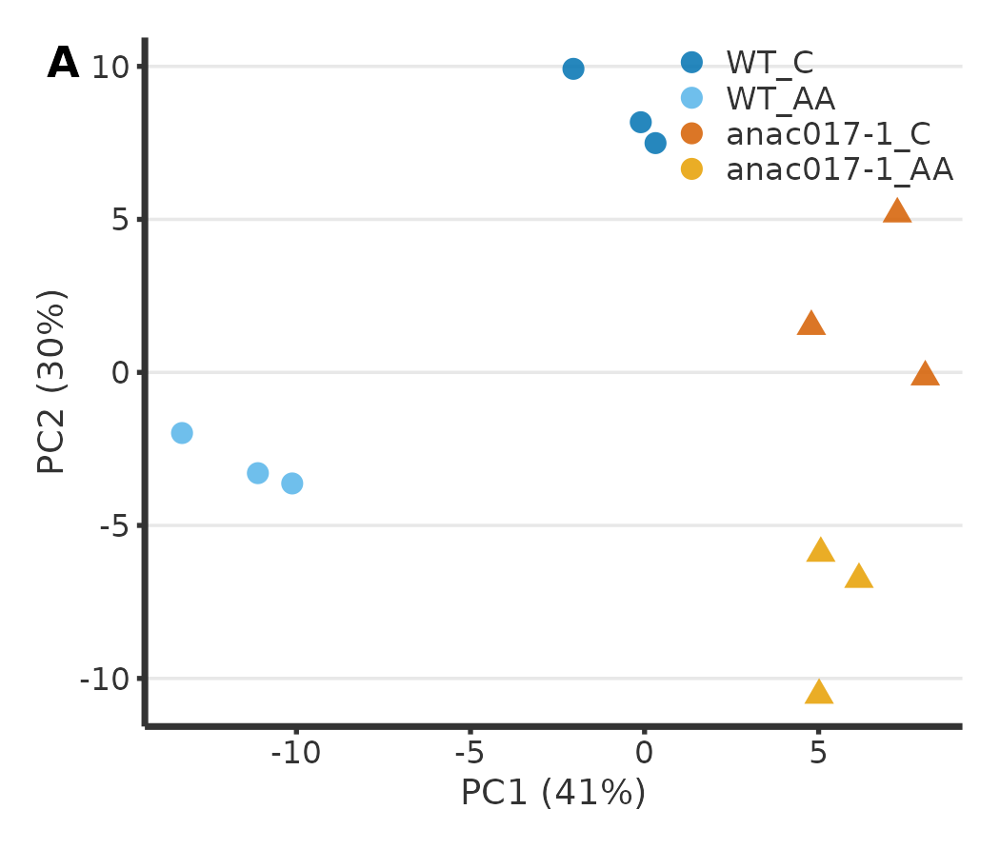
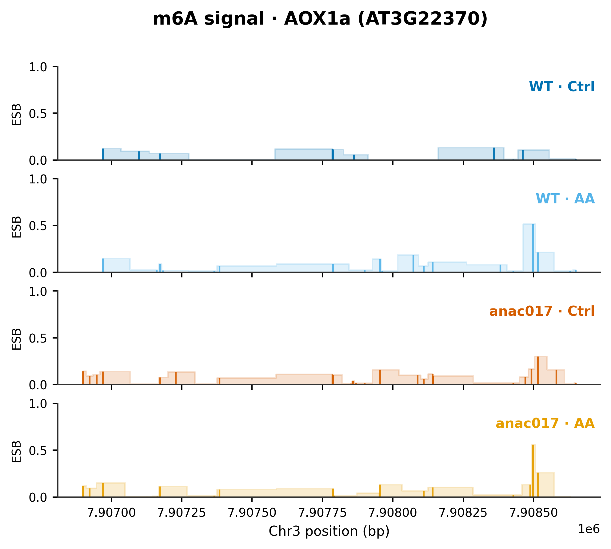
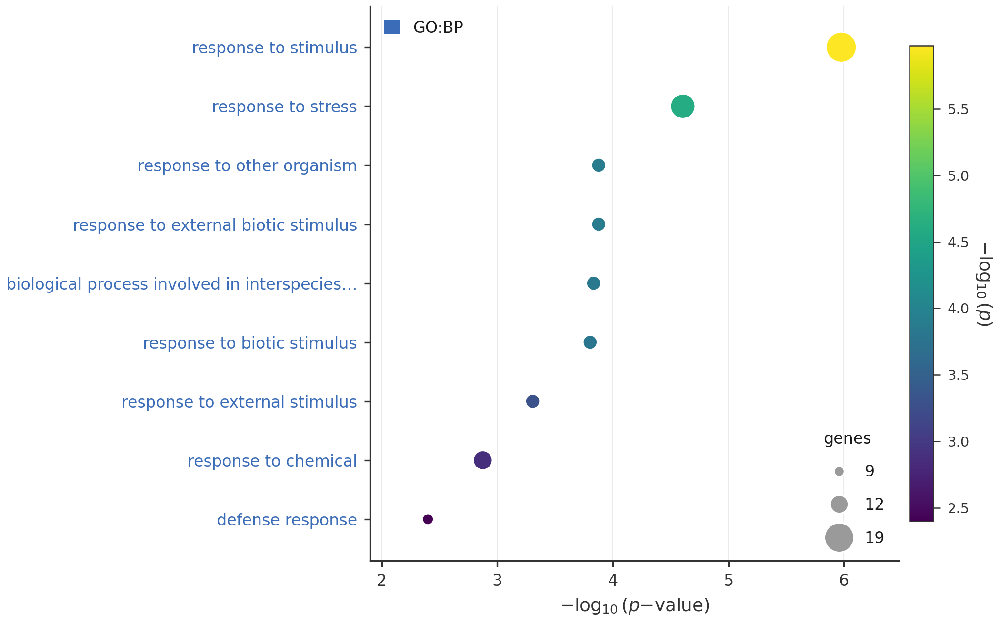

## The gap {.smaller}

::: {.columns}
::: {.column width="58%"}
- **m6A** is the most abundant mRNA modification — it tunes stability, splicing, translation.
- Nanopore **Direct RNA-seq (DRS)** reads it on **native** RNA.
- But plant-ready, **reproducible** workflows are scarce.

::: {.fragment .green-box}
**K-CHOPORE** — signal → m6A map → expression → function, in one reproducible (Docker/FAIR) pipeline.
:::
:::
::: {.column width="42%"}
{width="100%"}

::: {.tinycap}
m6A motif (RRACH), validated with writer mutants
:::
:::
:::

## The pipeline {.smaller}

```{mermaid}
flowchart LR
  A[Basecalling] --> B[Mapping<br>minimap2]
  B --> C[QC<br>NanoPlot · pycoQC]
  C --> D[Isoforms<br>FLAIR]
  D --> E[m6A<br>ELIGOS2 · m6anet]
  E --> F[Expression<br>DESeq2]
  F --> G[Function<br>GO]
  G --> H[(Docker · FAIR)]
```

**One Snakemake config** controls the whole run; precomputed steps are reused, only what changed re-runs.

## Case study: mitochondrial retrograde response {.smaller}

::: {.columns}
::: {.column width="50%"}
**2×2 design** · *WT* vs *anac017-1* × Control vs **Antimycin A** · n = 3

{width="100%"}

::: {.tinycap}
PCA: PC1 = genotype, PC2 = treatment
:::
:::
::: {.column width="50%"}
{width="100%"}

::: {.tinycap}
m6A gained at **AOX1a** under Antimycin A
:::
:::
:::

## What we find {.smaller}

::: {.columns}
::: {.column width="55%"}
- **151** transcripts respond to AA; **19** in an **ANAC017-dependent** way (interaction).
- **~86%** of AA-gained m6A sites in WT are **ANAC017-dependent**.
- AA-responsive genes enriched in **stress / hypoxia** (e.g. *CYP81D8*).
:::
::: {.column width="45%"}
{width="100%"}

::: {.tinycap}
GO · ANAC017-dependent genes
:::
:::
:::

## Reproducible by design {background-color="#1F6B3B"}

::: {.whitetext}
**Docker image + Snakemake + one config**

Clone → `docker run` → edit config → run.

🔗 **github.com/biopelayo/kchopore-anac017-drs**

*A reusable, FAIR resource for plant epitranscriptomics.*
:::

## Thank you {.smaller}

**K-CHOPORE** turns raw nanopore signal into a coverage-controlled m6A map — reproducibly.

Pelayo G. de Lena Rodríguez · bio.pelayo@gmail.com
Univ. Oviedo / FINBA · 1st EpiCrops Conference, Oviedo 2026
